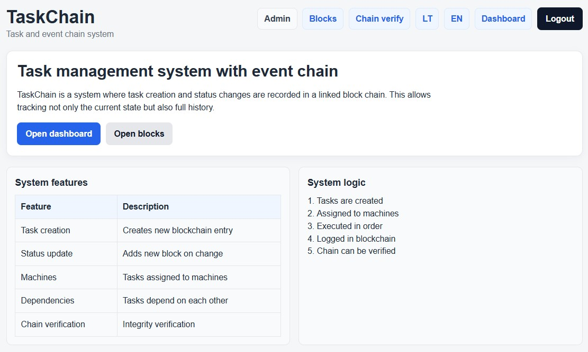
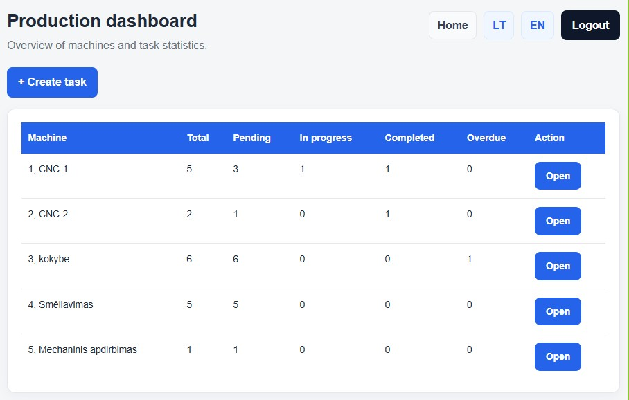
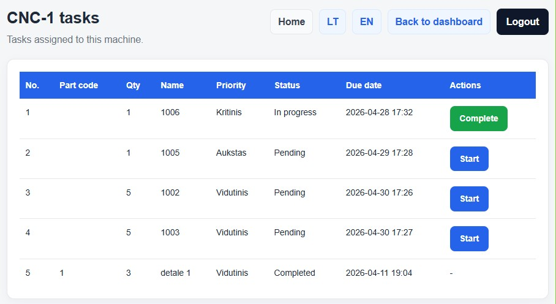
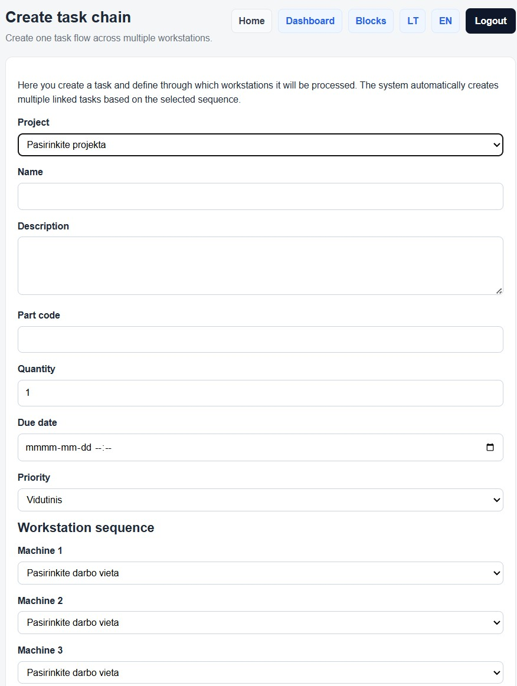

# TaskChain System

TaskChain is a Django-based production task management system with a blockchain-inspired audit trail.

---

## 🖥️ System Preview

### Home page



### Dashboard



### Machine tasks (workflow)



### Create task chain



---

## Core Features

* Task management across multiple workstations
* Task dependency workflow (`depends_on`)
* Role-based access (manager / operator / admin)
* Blockchain-like event logging (hash + prev_hash)
* Chain integrity verification

---

## How it works

* Tasks are created under a project
* Assigned to machines (workstations)
* Executed in sequence
* Each action is recorded as a block
* Chain integrity can be verified

---

## Blockchain logic

Each important event is stored as a block:

* `TASK_CREATED`
* `TASK_STATUS_CHANGED`
* `TASK_PRIORITY_CHANGED`
* `TASK_MACHINE_CHANGED`
* `TASK_REORDERED`

Each block contains:

* `hash`
* `prev_hash`

This ensures:

* data integrity
* tamper detection

---

## Technologies

* Python
* Django
* SQLite
* HTML / CSS

---

## Run project

```bash
git clone https://github.com/asavalenkovas/taskchain-system.git
cd taskchain-system

python -m venv venv
venv\Scripts\activate

pip install django
python manage.py migrate
python manage.py createsuperuser
python manage.py runserver
```

Open:
http://127.0.0.1:8000/

---

## About

This project demonstrates how production workflows can be combined with a blockchain-inspired audit system to ensure transparency and data integrity.
